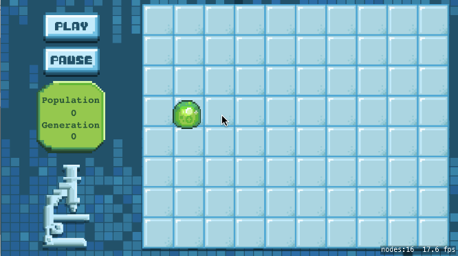

# Game of Life Tutorial :four::two:

In this tutorial, you will be implementing Conway's Game of Life, a zero player, cellular automaton simluation.
If you're interested in some further reading, [Wikipedia](https://en.wikipedia.org/wiki/Conway%27s_Game_of_Life) has a great
article detailing its historical background and mathematical ramifications.

These are the basic rules:
- If a cell has fewer than two neighbors OR more than three neighbors, it dies
- If a live cell has exactly two or three neighbors, it lives
- If a dead cell has exactly three neighbors, it respawns

## What you will learn :white_check_mark:
Upon completing this tutorial, you will have learned how to:
- Subclass SKSpriteNode and build a custom, simulation node
- Programatically generate and update a grid of sprites
- Handle Touch Input
- Manipulate a 2D Array
- Build a Scheduler
- Translate Game of Life's mathematical principles and logic into code

## Common issues :bug:

## What you should understand when finished :checkered_flag:
- The Grid Class: Created this subclass of SKSpriteNode and built a self-contained simulation node
- Creature Generation: Wrote and automated methods that spawn creatures at given grid positions
- Touch Input: Allowed users to manually spawn and despawn cells based on grid row / column position
- 2D Arrays: Created a 2D Array and implemented *neighborCount* method
- Game of Life Rules: Translated Game of Life rules into code conditionals and logic
